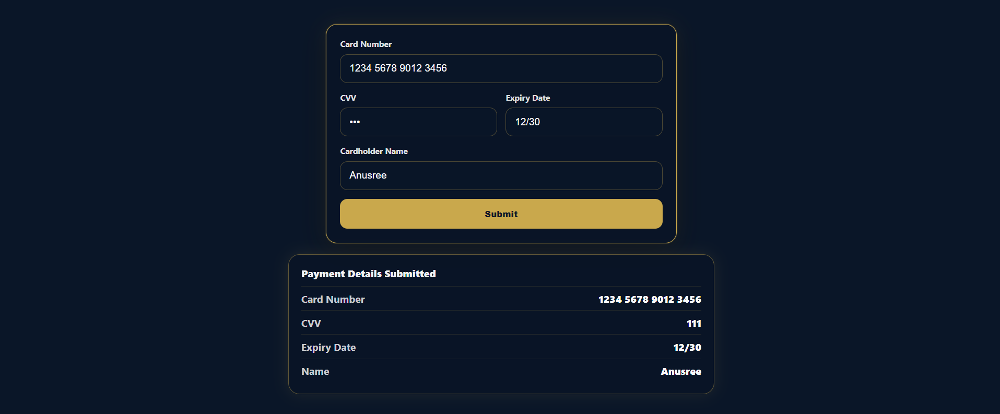

# Card Payment UI

A reusable and config-driven card payment form built with React and Vite.  
The UI follows a dark premium theme and includes field-level formatting, validation, auto-focus flow, and submitted details preview.

## UI Preview

### Screenshot 1 - Payment Form


### Screenshot 2 - Submitted Details



## What Is Implemented

- Config-driven form rendering via `src/config/fieldConfig.js`
- Reusable input field component using `React.memo` (`CardField`)
- Custom hook based architecture:
  - `useCardForm` for overall form state and submission
  - `useCardNumber` for card number formatting and mask overlay behavior
  - `useExpiryDate` for `MM/YY` formatting and slash handling
  - `useFieldValidation` for per-field and full-form validation
- Input rules:
  - Card Number: digits only, max 16, displayed as grouped format (`XXXX XXXX XXXX XXXX`)
  - CVV: digits only, max 3, password input
  - Expiry Date: digits only, displayed as `MM/YY`
  - Cardholder Name: alphabets and spaces only (max 26 chars)
- Auto-focus flow:
  - Card Number (16 digits) -> CVV
  - CVV (3 digits) -> Expiry Date
  - Expiry Date complete -> Cardholder Name
- Validation with clear error messages for all fields
- Submit button enabled only when the full form is valid
- Submitted details panel shown below form after successful submission


## Project Structure

```text
src/
  components/
    PaymentCard/
      CardField.jsx
      PaymentCard.css
      PaymentCard.jsx
      SubmittedDetails.jsx
      index.js
  config/
    fieldConfig.js
  hooks/
    useCardForm.js
    useCardNumber.js
    useExpiryDate.js
    useFieldValidation.js
  utils/
    validators.js
  App.jsx
  main.jsx
```

## Tech Stack

- React
- Vite
- JavaScript (ES modules)
- CSS
- ESLint

## Getting Started

### 1) Install dependencies

```bash
npm install
```

### 2) Run development server

```bash
npm run dev
```

### 3) Build for production

```bash
npm run build
```

### 4) Preview production build

```bash
npm run preview
```

## Available Scripts

- `npm run dev` - Start local dev server
- `npm run build` - Create production build
- `npm run preview` - Preview production build locally
- `npm run lint` - Run ESLint checks
